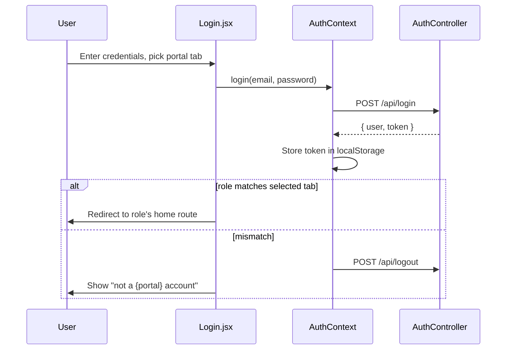
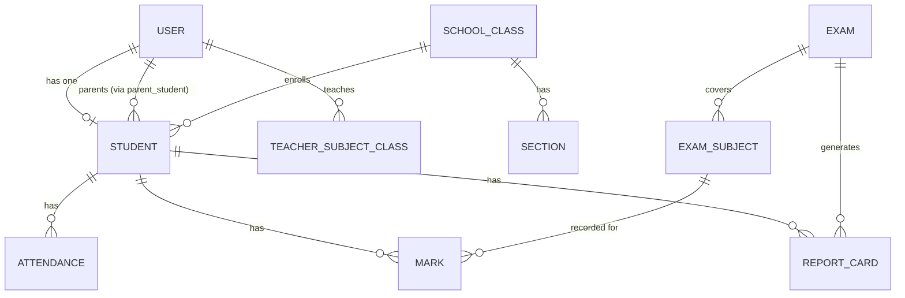

<h1>🏛️ System Architecture</h1>

How the pieces fit together — tech stack, folder structure, request flow.

## 1. High-Level Architecture

<table>
<tr>
<td style="background:#1B2A4A;color:#fff;padding:14px;text-align:center;width:20%;">👤 <strong>User</strong> Web browser</td>
<td style="text-align:center;width:6%;">→</td>
<td style="background:#B8860B;color:#fff;padding:14px;text-align:center;width:20%;">⚛️ <strong>React SPA</strong> Vite + React Router</td>
<td style="text-align:center;width:6%;">→</td>
<td style="background:#2F7D5C;color:#fff;padding:14px;text-align:center;width:20%;">🐘 <strong>Laravel API</strong> routes/api.php</td>
<td style="text-align:center;width:6%;">→</td>
<td style="background:#6B7280;color:#fff;padding:14px;text-align:center;width:20%;">🗄️ <strong>MySQL</strong> via XAMPP</td>
</tr>
</table>

## 2. Technology Stack

<table>
<tr><th>Layer</th><th>Technology</th><th>Purpose</th></tr>
<tr><td>Frontend</td><td>React 18 + Vite</td><td>SPA UI, bundled by Laravel's Vite plugin</td></tr>
<tr><td>Routing (client)</td><td>React Router v6</td><td>All frontend navigation — Laravel only serves one catch-all route</td></tr>
<tr><td>HTTP client</td><td>Axios</td><td>Single shared instance, auto-attaches Bearer token</td></tr>
<tr><td>Styling</td><td>Tailwind CSS + inline tokens</td><td>Utility layout, exact hex colors for the design system (see design.md)</td></tr>
<tr><td>Backend</td><td>Laravel (PHP)</td><td>API-only — no server-rendered pages except the one SPA shell</td></tr>
<tr><td>Auth</td><td>Laravel Sanctum (token-based)</td><td><code>Authorization: Bearer &lt;token&gt;</code>, stored in localStorage</td></tr>
<tr><td>Database</td><td>MySQL (XAMPP)</td><td>22 tables, one per module</td></tr>
<tr><td>PDF generation</td><td>barryvdh/laravel-dompdf</td><td>Report card PDFs (Phase 5)</td></tr>
</table>

> Diagrams below are [Mermaid](https://mermaid.js.org) — render automatically in
> VS Code's Markdown Preview (`Cmd+Shift+V`) and on GitHub.

## 3. Request Flow

```mermaid
flowchart LR
    Browser["Browser"] -->|"any URL"| WebRoute["routes/web.php\ncatch-all route"]
    WebRoute --> Blade["app.blade.php\n(the ONLY blade view)"]
    Blade --> ReactApp["React SPA (App.jsx)"]
    ReactApp -->|"client routing"| Portals["Portal screens"]
    Portals -->|"Axios + Bearer token"| ApiRoute["routes/api.php\n(role middleware)"]
    ApiRoute --> Controllers["Controllers"]
    Controllers --> Models["Eloquent Models"]
    Models --> DB[("MySQL")]
```

## 4. Auth Flow

## 5. Core Entity Relationships

## 6. Folder Structure

<table>
<tr><th>Path</th><th>Contents</th></tr>
<tr><td><code>app/Http/Controllers/Api/</code></td><td>One controller per resource — Auth, AcademicYear, SchoolClass, Section, Subject, User, Student, TeacherAssignment, ParentLink, Attendance, ExamType, Exam, Mark, ReportCard</td></tr>
<tr><td><code>app/Http/Middleware/EnsureUserHasRole.php</code></td><td>Aliased as <code>role</code> in <code>bootstrap/app.php</code></td></tr>
<tr><td><code>app/Models/</code></td><td>One model per table</td></tr>
<tr><td><code>resources/views/app.blade.php</code></td><td>The ONLY blade view — mounts the React SPA</td></tr>
<tr><td><code>resources/js/App.jsx</code></td><td>Top-level router — source of truth for every route</td></tr>
<tr><td><code>resources/js/api/client.js</code></td><td>Axios instance, Bearer token auto-attach</td></tr>
<tr><td><code>resources/js/auth/</code></td><td>AuthContext, RequireRole route guard</td></tr>
<tr><td><code>resources/js/layouts/DashboardLayout.jsx</code></td><td>Sidebar + content shell; <code>NAV_BY_ROLE</code> is the nav source of truth</td></tr>
<tr><td><code>resources/js/components/ui.jsx</code></td><td>Shared design-system primitives — see design.md</td></tr>
<tr><td><code>resources/js/portals/{role}/</code></td><td>Screens grouped by role</td></tr>
<tr><td><code>routes/api.php</code></td><td>Every backend route, grouped by role middleware</td></tr>
<tr><td><code>database/migrations/</code></td><td>22 tables covering every module</td></tr>
<tr><td><code>database/seeders/SchoolStructureSeeder.php</code></td><td>Seeds classes 1–13, sections, subjects, year, super-admin login</td></tr>
</table>

## 7. Known Gaps

<table>
<tr><td style="background:#B8860B;color:#fff;padding:6px 10px;">⚠️</td><td>No live/real-time sync — every screen fetches once on mount</td></tr>
<tr><td style="background:#B8860B;color:#fff;padding:6px 10px;">⚠️</td><td>No Form Request classes — validation is inline per controller</td></tr>
<tr><td style="background:#B8860B;color:#fff;padding:6px 10px;">⚠️</td><td><code>ExamController::index</code> for teachers returns all exams, filtered client-side</td></tr>
</table>
