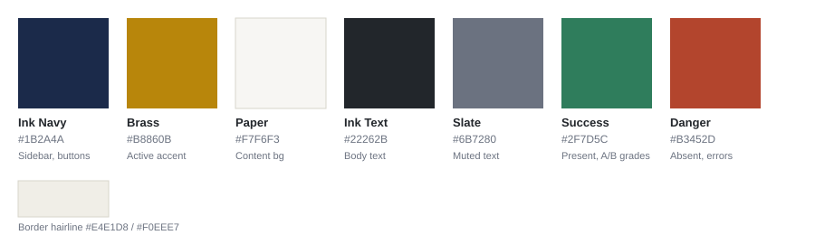
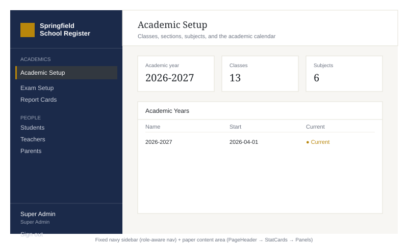
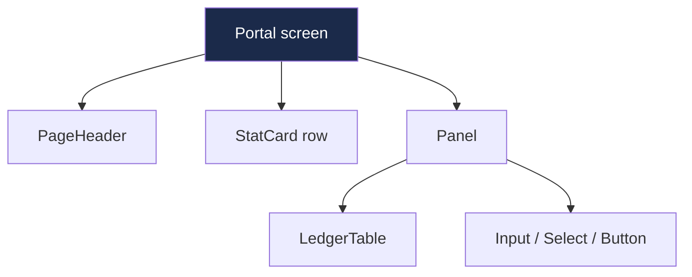

<h1>🎨 Design System — "Academic Ledger"</h1>

An institution's record system, not a startup dashboard.

## 1. Design Principles

<table>
<tr>
<td style="background:#1B2A4A;color:#fff;padding:14px;text-align:center;width:20%;">📖 <strong>Ledger Feel</strong> Flat borders, no shadows</td>
<td style="background:#1B2A4A;color:#fff;padding:14px;text-align:center;width:20%;">✨ <strong>One Bold Color</strong> Brass, used sparingly</td>
<td style="background:#1B2A4A;color:#fff;padding:14px;text-align:center;width:20%;">🧩 <strong>Consistent</strong> Same 7 primitives everywhere</td>
<td style="background:#1B2A4A;color:#fff;padding:14px;text-align:center;width:20%;">🎭 <strong>Role Clarity</strong> Nav shows only what's relevant</td>
<td style="background:#1B2A4A;color:#fff;padding:14px;text-align:center;width:20%;">📱 <strong>Responsive</strong> Works at any width</td>
</tr>
</table>

## 2. Color Palette

<table>
<tr><th>Swatch</th><th>Name</th><th>Hex</th><th>Used for</th></tr>
<tr><td style="background:#1B2A4A;width:40px;"></td><td>Ink Navy</td><td><code>#1B2A4A</code></td><td>Sidebar, primary buttons</td></tr>
<tr><td style="background:#B8860B;width:40px;"></td><td>Brass</td><td><code>#B8860B</code></td><td>Active nav accent — the ONE bold color</td></tr>
<tr><td style="background:#F7F6F3;width:40px;border:1px solid #D8D5CB;"></td><td>Paper</td><td><code>#F7F6F3</code></td><td>Content background</td></tr>
<tr><td style="background:#22262B;width:40px;"></td><td>Ink Text</td><td><code>#22262B</code></td><td>Body text</td></tr>
<tr><td style="background:#6B7280;width:40px;"></td><td>Slate</td><td><code>#6B7280</code></td><td>Muted text, labels</td></tr>
<tr><td style="background:#2F7D5C;width:40px;"></td><td>Success</td><td><code>#2F7D5C</code></td><td>Present, passing grades, "Done" badges</td></tr>
<tr><td style="background:#B3452D;width:40px;"></td><td>Danger</td><td><code>#B3452D</code></td><td>Absent, errors, "Not Started" badges</td></tr>
</table>

## 3. Typography

<table>
<tr>
<td style="padding:20px;text-align:center;width:15%;">
Aa
</td>
<td>
<strong>Source Serif 4</strong> — headings, page titles, stat numbers 
<strong>Inter</strong> — body text, tables, form labels, buttons 
Both loaded via Google Fonts in app.blade.php
</td>
</tr>
</table>

## 4. Layout Reference

<table>
<tr><th>Zone</th><th>Treatment</th></tr>
<tr><td>Sidebar</td><td>Fixed ~256px, navy background, role-aware nav sections</td></tr>
<tr><td>Active nav item</td><td>3px brass left bar + light brass background wash — never a filled pill</td></tr>
<tr><td>Content area</td><td>Paper background → PageHeader → StatCard row → Panels</td></tr>
<tr><td>Panels/tables</td><td>Flat borders, hairline dividers — NO rounded corners, NO shadows</td></tr>
</table>

## 5. UI Components Preview

<table>
<tr><th>Component</th><th>Example</th></tr>
<tr><td>Primary Button</td><td>Save Attendance</td></tr>
<tr><td>Danger link</td><td>Remove</td></tr>
<tr><td>Input field</td><td>Subject name</td></tr>
<tr><td>Status badge — success</td><td>Present</td></tr>
<tr><td>Status badge — danger</td><td>Absent</td></tr>
<tr><td>Status badge — pending</td><td>Late</td></tr>
<tr><td>StatCard</td><td>
<table><tr><td style="border:1px solid #E4E1D8;padding:10px 16px;">

Classes

13

</td></tr></table>
</td></tr>
</table>

## 6. Component Composition

Every screen is built from `resources/js/components/ui.jsx`:

**Rule of thumb:** before writing a new Tailwind combination for a box, table,
or button — check `ui.jsx` first.

## 7. What to Avoid

<table>
<tr><td style="background:#B3452D;color:#fff;padding:6px 10px;">🚫</td><td>Rounded cards with soft shadows, colorful icon-per-metric rows, hero gradients</td></tr>
<tr><td style="background:#B3452D;color:#fff;padding:6px 10px;">🚫</td><td>A second "loud" accent color — brass is the only bold color in the system</td></tr>
<tr><td style="background:#B3452D;color:#fff;padding:6px 10px;">🚫</td><td>Tailwind's default palette (<code>bg-blue-500</code>, etc.) — always the exact hex tokens above</td></tr>
</table>
