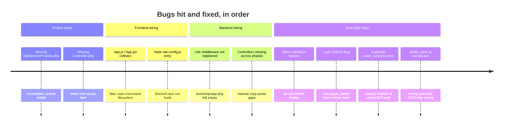

<h1>🧠 Project Memory</h1>

Context, decisions, and bugs — so a fresh session doesn't re-debug something that already happened once.

<table>
<tr>
<td style="padding:14px;width:25%;">

📅 LAST UPDATED

Phase 5

</td>
<td style="padding:14px;width:25%;">

👤 CURRENT PHASE

Report Cards

</td>
<td style="padding:14px;text-align:center;width:25%;">
<svg width="60" height="60" viewBox="0 0 36 36">
  <path stroke="#F0EEE7" stroke-width="3" fill="none" d="M18 2.0845 a 15.9155 15.9155 0 0 1 0 31.831 a 15.9155 15.9155 0 0 1 0 -31.831"/>
  <path stroke="#2F7D5C" stroke-width="3" fill="none" stroke-dasharray="48, 100" d="M18 2.0845 a 15.9155 15.9155 0 0 1 0 31.831 a 15.9155 15.9155 0 0 1 0 -31.831"/>
  <text x="18" y="21" font-size="9" text-anchor="middle" fill="#22262B">48%</text>
</svg>

OVERALL PROGRESS

</td>
<td style="padding:14px;width:25%;">

🚦 STATUS

In Development
</td>
</tr>
</table>

## Bug History at a Glance

## Resolved Issues Log

<table>
<tr><th>#</th><th>Issue</th><th>Root Cause</th><th>Fix</th></tr>
<tr>
<td>1</td><td>Missing <code>AppServiceProvider.php</code></td>
<td>Incomplete <code>composer create-project</code></td>
<td>Fixed Started fresh project</td>
</tr>
<tr>
<td>2</td><td>Missing <code>Controller.php</code></td>
<td>Same root cause, surfaced later</td>
<td>Fixed Restored default content</td>
</tr>
<tr>
<td>3</td><td><code>App.js</code>/<code>App.jsx</code> collision</td>
<td>Mac case-insensitive filesystem</td>
<td>Fixed Deleted old file, explicit <code>.jsx</code> import</td>
</tr>
<tr>
<td>4</td><td><code>role</code> middleware not registered</td>
<td><code>bootstrap/app.php</code> left empty</td>
<td>Fixed Added middleware alias</td>
</tr>
<tr>
<td>5</td><td>Controllers missing across phases</td>
<td>Manual copy-paste skipped files</td>
<td>Fixed Switched to Claude Code + post-apply audit</td>
</tr>
<tr>
<td>6</td><td>Stale <code>vite.config.js</code> entry</td>
<td>Still referenced deleted <code>app.js</code></td>
<td>Fixed Pointed at <code>main.jsx</code></td>
</tr>
<tr>
<td>7</td><td>Silent validation failures</td>
<td>No <code>catch</code> error display on forms</td>
<td>Fixed Standing rule added — see rules.md</td>
</tr>
<tr>
<td>8</td><td>Login redirect bug</td>
<td>Only <code>super_admin</code> had a redirect target</td>
<td>Fixed Role→route map + portal tabs</td>
</tr>
<tr>
<td>9</td><td>Duplicate <code>exam_subjects</code> rows</td>
<td><code>create()</code> instead of <code>updateOrCreate</code></td>
<td>Fixed Switched to <code>updateOrCreate</code>; manual DB cleanup needed</td>
</tr>
<tr>
<td>10</td><td>snake_case vs camelCase key mismatch</td>
<td>Assumed wrong JSON casing for a relation</td>
<td>Fixed Standing rule added — verify via Network tab</td>
</tr>
</table>

## Key Decisions

<table>
<tr><td style="background:#1B2A4A;color:#fff;padding:8px 12px;width:180px;">Auth approach</td><td>Sanctum token-based (Bearer), not cookie/session — avoids CORS/CSRF complexity across separate dev servers</td></tr>
<tr><td style="background:#1B2A4A;color:#fff;padding:8px 12px;">Design direction</td><td>"Academic Ledger" — navy/brass/paper, flat borders, one bold accent color</td></tr>
<tr><td style="background:#1B2A4A;color:#fff;padding:8px 12px;">Login portal picker</td><td>Added after the redirect bug made successful non-admin logins look broken</td></tr>
<tr><td style="background:#1B2A4A;color:#fff;padding:8px 12px;">Parent module</td><td>Backend existed since Phase 2 but had no screen — built out once the gap was noticed</td></tr>
</table>

## Open/Known Gaps

<table>
<tr><td style="background:#B8860B;color:#fff;padding:6px 10px;">⚠️</td><td><code>ExamController::index</code> for teachers returns all exams, filtered client-side</td></tr>
<tr><td style="background:#B8860B;color:#fff;padding:6px 10px;">⚠️</td><td>No live updates — every screen fetches once on mount</td></tr>
</table>

## Working Style Notes

- Phases delivered as zips with `docs/SETUP.md` stating CREATE/REPLACE/MERGE per file
- Claude Code (VS Code) applies changes + audits for missing files/broken imports
- Local stack: XAMPP (MySQL), `php artisan serve` (:8000), `npm run dev` (:5173)
- Project path: `~/Desktop/Laravel/school-management`
